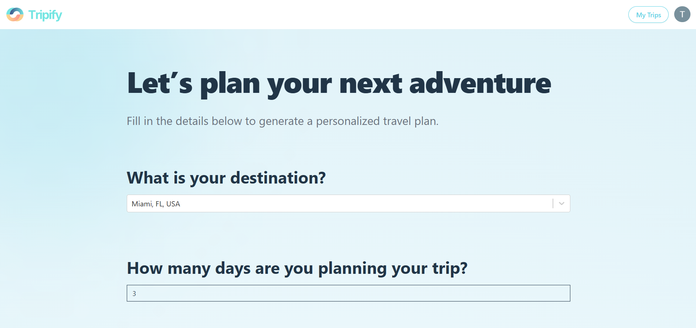
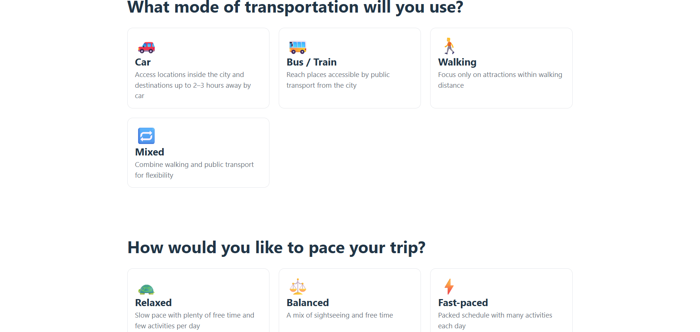
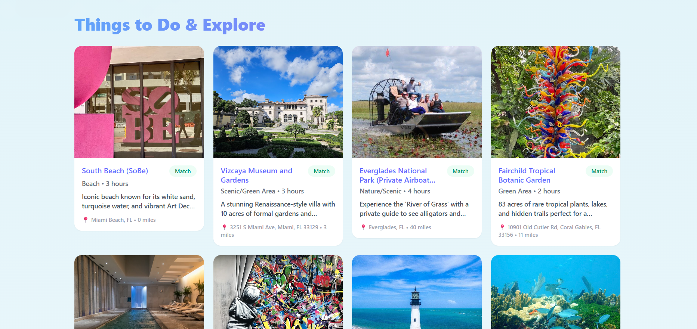
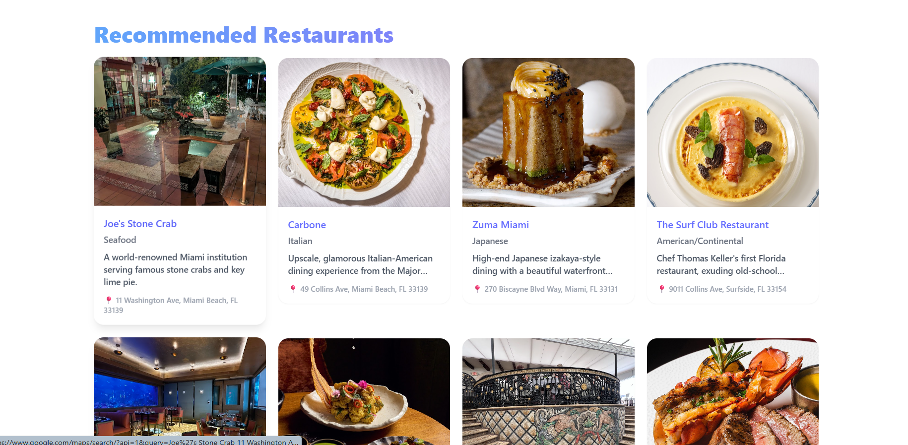
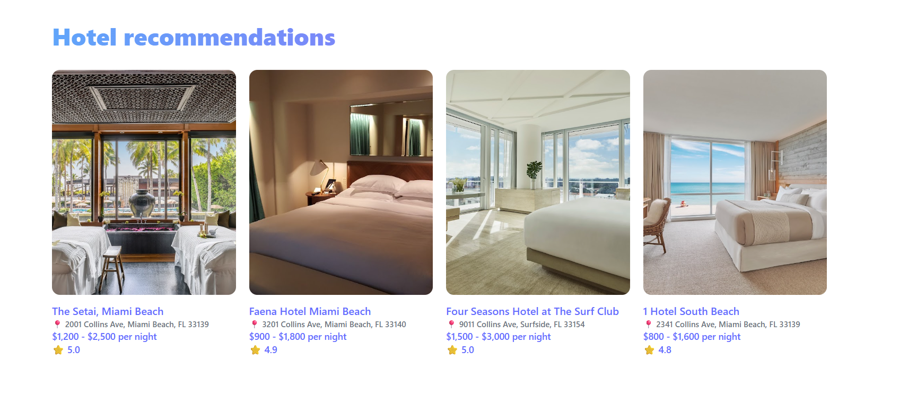
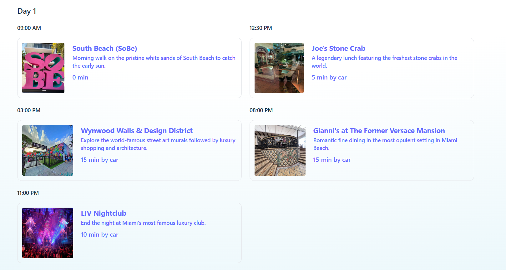

# ✈️ Tripify – AI Travel Planner

🔗 **Live:** https://tripplanner-vert.vercel.app/

## About

Tripify generates personalized travel itineraries based on user inputs: destination, number of days, budget, group type, transport mode, travel pace, and activity preferences. The result is a structured plan with a day-by-day itinerary, activities, restaurant suggestions, and hotel options.

Built out of a real need for quick trip planning, and as a way to practice React, Tailwind, and full-stack architecture.

##  Overview

Tripify allows users to:

- Select a destination using Google Places Autocomplete
- Customize trip parameters (days, budget, group type, transport mode, travel pace, activity preferences)
- Generate a structured itinerary powered by Gemini
- Save and revisit past trips via Firestore
  
## How it works

1. User fills in trip preferences via a form
2. A dynamic prompt is constructed and sent to a Node.js backend
3. The backend calls the Gemini API and returns a JSON travel plan
4. The plan is saved to Firestore and displayed to the user
5. Past trips are accessible from the user's account at any time

## Tech Stack

**Frontend** — React (Vite), Tailwind CSS  
**Backend** — Node.js + Express   
**AI** — Google Gemini   
**Auth** — Google OAuth   
**Database** — Firebase Firestore  
**APIs** — Google Places Autocomplete, Google Places Photos  
**Deployment** — Vercel (frontend), Render (backend)

## Features

- Google Places autocomplete for destination input
- Trip form: days, budget, group size, traveler type, transport, pace, activity preferences (multi-select)
- AI-generated itinerary saved to Firestore per user
- Google Sign-In (required before generating a trip)
- My Trips page to view past plans
- Scroll reveal animations on the form sections

### Destination Input

### Preferences Selection

### Recommended Activities

### Recommended Restaurants

### Recommended Hotels

### Recommended Itinerary

Inspired by: https://youtu.be/f_7grfh9TxU?si=90xIsgNr75X0P-xI
